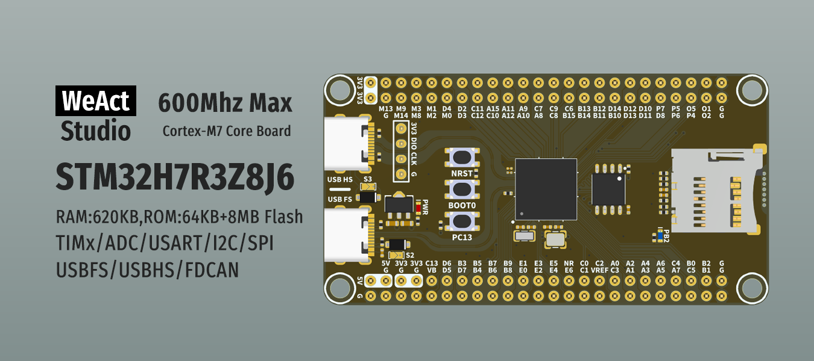
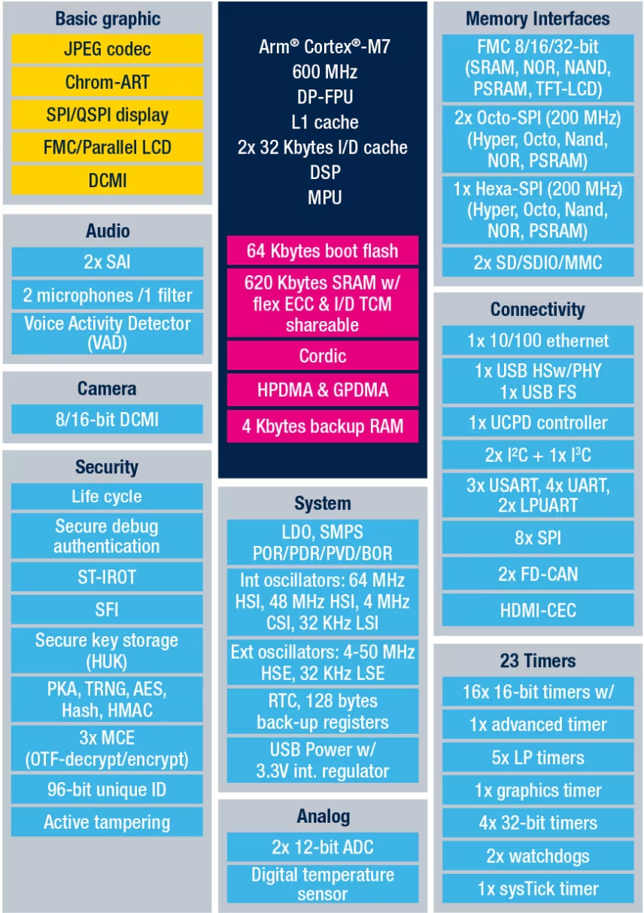

# STM32H7R3
Знакомство с STM32H7R3 на базе Development Board [WeAct-STM32H7R3Zx](https://aliexpress.ru/item/1005010466566322.html)

    

### [STM32H7R3Z8](https://www.st.com/en/microcontrollers-microprocessors/stm32h7r3z8.html)

Микроконтроллеры STM32H7Rxx8 построены на основе высокопроизводительного 32-разрядного RISC-ядра Arm® Cortex®-M7, работающего на частоте до 600 МГц. Ядро Cortex-M7 включает блок обработки чисел с плавающей запятой (FPU), который поддерживает инструкции и типы данных одинарной и двойной точности (соответствующие стандарту IEEE 754). Ядро Cortex-M7 содержит 32 КБ кэш-памяти инструкций и 32 КБ кэш-памяти данных. Микроконтроллеры STM32H7Rxx8 поддерживают полный набор DSP-инструкций и модуль защиты памяти (MPU) для повышения безопасности приложений.

Микроконтроллеры STM32H7Rxx8 включают высокоскоростную встроенную память: 64 КБ пользовательской флеш-памяти и 128 КБ системной флеш-памяти, а также до 620 КБ оперативной памяти (включая 128 КБ, которые могут быть разделены между ITCM и шиной AXI, из них 64 КБ выделены исключительно для ITCM; 128 КБ DTCM, из них 64 КБ выделены исключительно для DTCM; 32 КБ AHB и 4 КБ резервной RAM). Также предусмотрен широкий набор расширенных портов ввода-вывода и периферийных устройств, подключенных к шинам APB, AHB, матрице из двух 32-разрядных мульти-шин AHB и многоуровневому межсоединению AXI, обеспечивающему доступ к внутренней и внешней памяти. Для повышения надежности приложений во всех типах памяти реализована коррекция ошибок (ECC) с возможностью исправления одной ошибки и обнаружения двух.

Микроконтроллеры содержат периферийные модули, ускоряющие выполнение математических/арифметических функций (сопроцессор CORDIC для тригонометрических функций). Все устройства оснащены двумя АЦП, малопотребляющими часами реального времени (RTC), четырьмя 32-разрядными таймерами общего назначения, семью 16-разрядными таймерами общего назначения (включая один ШИМ-таймер для управления двигателями), пятью малопотребляющими таймерами, генератором истинно случайных чисел (RNG), процессором хеширования (HASH), ускорителем проверки открытых ключей (PKA — только верификация ECDSA). Устройства поддерживают один цифровой фильтр для внешних сигма-дельта модуляторов или цифровых микрофонов с функцией обнаружения голосовой активности. Также имеются стандартные и расширенные интерфейсы связи.

 

    

